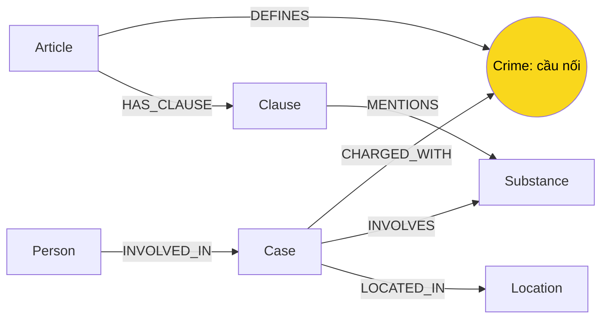

# Thiết kế Ontology — Day 19

**Họ tên:** Đinh Mạnh Dũng — **MSSV:** 2A202602975

- [x] Dùng ontology gợi ý, chỉnh nhỏ cách truy xuất.
- [ ] Tự thiết kế (không yêu cầu bonus +15).

## 1. Sơ đồ

## 2. Entity types

| Label | Ý nghĩa | Khóa MERGE | Properties | KB | Trích xuất |
| --- | --- | --- | --- | --- | --- |
| Article | Một Điều, phân biệt cả tên luật | id | title, law, doc_id | Luật | metadata + regex |
| Clause | Khoản trong Điều | id = Điều + khoản | number, penalty, text, doc_id | Luật | regex đầu dòng |
| Crime | Tội danh chuẩn | name | name | Cả hai | tiêu đề Điều + liên kết tên LLM |
| Case | Vụ việc theo bài báo | name | summary, date, doc_id, source_title | Tin | LLM |
| Person | Người trong vụ việc | name | aliases | Tin | LLM |
| Substance | Chất được đề cập | name | name | Cả hai | danh sách chuẩn / LLM |
| Location | Tỉnh, thành phố | name | name | Tin | LLM |

Article, Clause và Case mang doc_id để nối vector chunk với graph. Crime, Substance, Person, Location là thực thể dùng chung, không gán một doc_id đơn lẻ vì nguồn sẽ bị ghi đè khi xuất hiện ở nhiều tài liệu. Truy ngược nguồn qua Case hoặc Article/Clause. Chưa lưu nguồn của từng khẳng định trên cạnh.

## 3. Relationships

| Type | Từ → Đến | Properties | Ý nghĩa |
| --- | --- | --- | --- |
| DEFINES | Article → Crime | không | Điều quy định tội danh |
| HAS_CLAUSE | Article → Clause | không | Khoản thuộc Điều |
| MENTIONS | Clause → Substance | không | Khoản nhắc tới chất |
| CHARGED_WITH | Case → Crime | không | Tội danh trong vụ |
| INVOLVES | Case → Substance | amount | Chất, khối lượng nguyên văn |
| LOCATED_IN | Case → Location | không | Địa điểm |
| INVOLVED_IN | Person → Case | role, sentence, charge | Vai trò, mức án, tội riêng của người |

## 4. Node cầu nối giữa 2 KB

Crime nối Case của tin với Article của luật: `Case-[:CHARGED_WITH]->Crime<-[:DEFINES]-Article`. Substance là cầu phụ để chọn khoản nhắc chất của vụ. Chuẩn hóa chữ thường, khoảng trắng, bỏ tiền tố “Tội”; link_entity khớp chính xác trước, rồi difflib ngưỡng 0,8, trả nguyên văn tên chuẩn. Prompt liệt kê tội danh có thật trong luật; code liên kết lại tội của cả vụ và từng người.

Cầu gãy nếu bài không nêu tội, LLM bỏ tội, hoặc Điều tương ứng ngoài corpus. Không nối bằng suy đoán khi không đạt ngưỡng. Kiểm tra Case không có CHARGED_WITH rồi đọc bài gốc. Tên gần giống không bảo đảm cùng ý nghĩa pháp lý, nên fuzzy matching vẫn cần kiểm tra khi mở rộng corpus.

## 5. Competency questions

| Câu | Đường đi / dữ kiện | Khả năng, giới hạn |
| --- | --- | --- |
| Q1 | Article Điều 2 PCMT → HAS_CLAUSE → Clause số 4; chunk chứa tiền chất | Hybrid trả từ chunk; bộ lọc graph khoản 1 + chất không bảo đảm lấy khoản 4 định nghĩa. |
| Q2 | Person → INVOLVED_IN → Case; đọc sentence, charge | Phụ thuộc extraction nhận đủ người và đúng vụ hơn 36kg. |
| Q3 | Person Lê Minh Thành → Case → Crime ← Article 251 → Clause số 1 | Mức án trên cạnh INVOLVED_IN, khung cơ bản từ khoản 1. |
| Q4 | Person alias Hoàng Nato → Case → Crime ← Article 255 → Clause | Tìm Điều được, có thể bỏ khoản 4 nếu vụ không ghi chất. |
| Q5 | Person Cái Quang Huy → Case → INVOLVES → MDMA; Case → Crime ← Article 250 → Clause → MENTIONS → MDMA | Lấy khoản 4, ngưỡng trong text; LLM phải so khối lượng, graph chưa tính số. |
| Q6 | Substance MDMA ← INVOLVES ← Case ← INVOLVED_IN ← Person | Seed theo MDMA tìm nhiều vụ; có thể lặp cùng vụ ở nhiều bài hoặc chạm giới hạn dữ kiện. |

Context lấy seed theo doc_id/name/aliases, mở rộng một bước tìm Case, rồi đi Case → Crime ← Article → Clause. Luôn giữ khoản 1, khoản khác phải nhắc chất của vụ. Article trong chunk truy xuất hoặc Điều nêu trực tiếp cũng được mở rộng. Đặt nguyên văn khoản trước cạnh để hạn mức 60 dữ kiện không che cầu nối; loại trùng chuỗi dữ kiện nhưng không gộp Case khác tên.

## 6. Quyết định thiết kế và đánh đổi

1. **Regex cho luật, LLM cho tin.** Luật có cấu trúc ổn định, regex không tốn token. LLM cho cả hai đắt và có nguy cơ sai; regex cho tin khó xử lý vai trò, biệt danh, mức án.
2. **Crime chung thay cho nối trực tiếp Case–Article.** Chuẩn hóa từ vựng và kiểm tra cầu nối tập trung; liên kết sai có thể dẫn Điều sai, cần ngưỡng fuzzy thận trọng.
3. **Mức án trên cạnh Person–Case.** Mỗi người trong vụ có mức án riêng, property Case sẽ nhập nhằng. Node Sentence riêng lưu lịch sử tốt hơn nhưng phức tạp; hiện chưa tách sơ thẩm/phúc thẩm.
4. **Chọn một phần khoản, giữ text.** Giảm prompt so với toàn bộ luật, nhưng có thể bỏ khung tối đa nếu luật không nêu chất. Text giữ điều kiện, ngưỡng, không chỉ penalty.
5. **Khóa tên cho Case, Person.** Dễ triển khai; mã hồ sơ ổn định hơn nhưng corpus không có. Cùng vụ khác tên có thể bị tách, người trùng tên có thể bị gộp. Phân tích bằng graph thực trong báo cáo.

## 7. So với ontology gợi ý

Không đăng ký bonus: dùng đúng 7 label, 7 loại quan hệ gợi ý. Chỉnh cách truy xuất không phải ontology mới. Không tạo benchmark hint giả hoặc coi đổi thứ tự prompt là thiết kế mới.

## 8. Hạn chế còn lại

Chưa có node giai đoạn tố tụng, chứng cứ, ngưỡng khối lượng dạng số; chưa tách người trùng tên. Extraction có thể lấy đoạn giới thiệu bài liên quan cuối bài thành vụ riêng. JSON không hợp lệ được helper bỏ qua; cần đối chiếu bài gốc khi graph thiếu vụ. Corpus luật là phiên bản được cấp trong lab; kết quả không xác minh hiệu lực luật hiện hành.